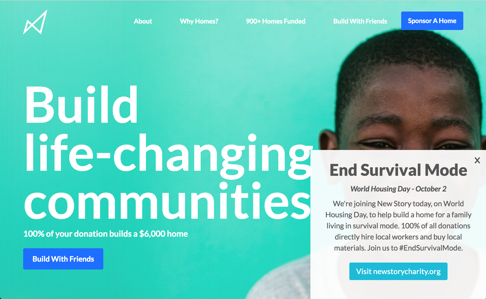
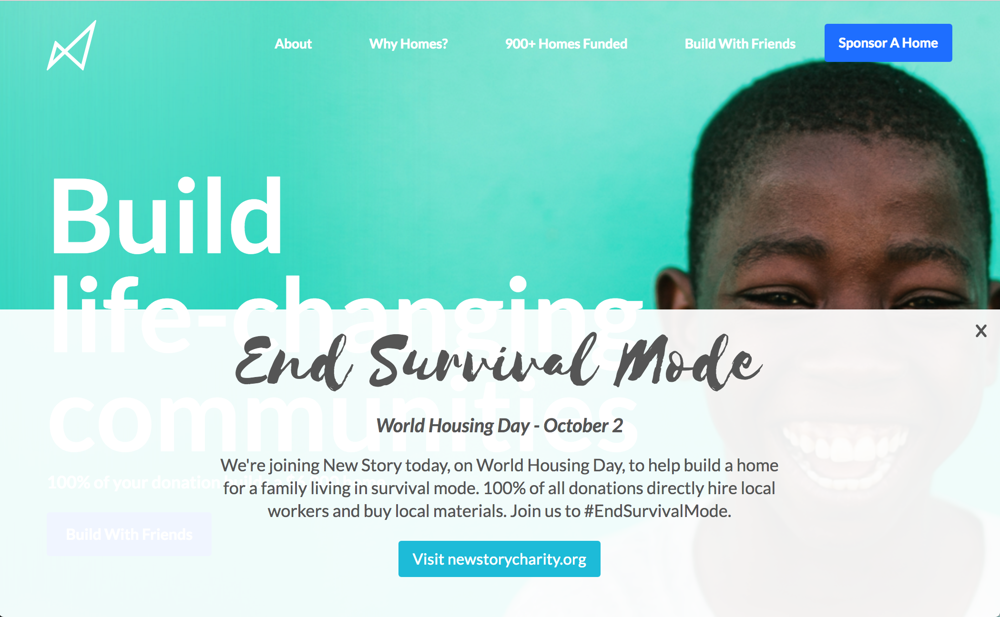
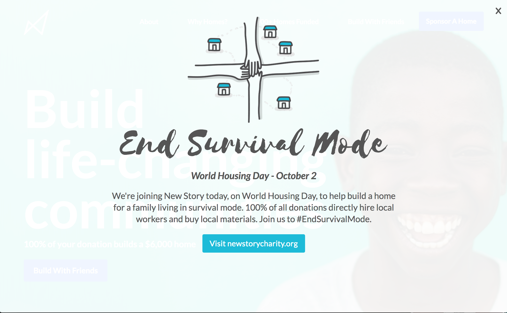

# Newstory

<h2>Who is Newstory</h2>
<p><em>Their vision:</em> "New Story is a non-profit working to create a world where no human being lives in survival mode."</p>
<p>Newstory is a non-profit charity based in San Fransisco. Since 2015, their donors have funded over 900+ homes for families living around the world. Through their organization, people can sponser a family, donate monthly, and even invite friends to help build a home.</p>

<h2>Our Helping Hand</h2>
<p>Our team teamed up with Newstory to build an overlay for October 2nd, 2017, World Housing Day. Newstory wanted to get the word out that anyone can help donate to this wonderful cause.</p>

<h2>Development Team</h2>
<p><b>Jennifer Johnson: </b>https://www.linkedin.com/in/jenniferlijohnson/ | https://github.com/jenlij <br>
<b>Katherine Lane:</b> https://www.linkedin.com/in/katherine-lane/ | https://github.com/MaeDae11 <br>
<b>Stephanie Asmar:</b> https://www.linkedin.com/in/stephanieasmar/ | https://github.com/stephanieasmar
</p>

<h2>Who Used the Overlay</h2>
<p>Many websites were gracious enough to donate a small, medium or full page space for Newstory's overlay. This means our team needed to create a user friendly, simple script people could input into their code.</p>

<h2>Our Tools</h2>
<p>After much deliberation, our team decided on combining vanilla JavaScript, HTML, and CSS to build the overlays. From there, the files were hosted on AWS to create easily accessiblility.</p>

<h2>Code Snippets</h2>
<p>Code showcases how we implement the JavaScript into another users website</p>

 ``` javascript

function addNewStoryBanner() {
    const newStoryBanner = 
    '<div class="new-story-overlay-wrapper">' +
        '<div class="overlay-container-new-story">' +

            '' +
            '<h1 class="new-story-h1-overlay">' +
                '<span class="new-story-text-span">End Survival Mode</span>' +
            '</h1>' +
            '<div class="new-story-overlay-small-text">' +
                '<em>World Housing Day - October 2</em>' +
            '</div>' +
            '<h4 class="new-story-h4-overlay">We\'re joining New Story today, on World Housing Day, to help build a home for a family living in survival mode. 100% of all donations directly hire local workers and buy local materials. Join us to #EndSurvivalMode.</h4>' +
            '<a class="new-story-overlay-button w-button-new-story" href="http://newstorycharity.org" target="_blank" rel="noopener noreferrer">Visit newstorycharity.org</a>' +
        '</div>' +
        '<div id="exit-new-story-overlay" class="new-story-close-overlay" data-ix="close-overlay-large">x</div>' +
    '</div>';

    var bannerLocation = document.getElementById('new-story-overlay-for-october');
    bannerLocation.innerHTML = newStoryBanner;
}

// makes exit x work
function exitOverlayNewStory(){
    const exitButtonNewStory = document.getElementById("exit-new-story-overlay");
    const exitNewStoryOverLay = document.getElementById("new-story-overlay-for-october"); 
    exitButtonNewStory.onclick = function() {
        exitNewStoryOverLay.style.display = "none";
    };
};

addNewStoryBanner();
exitOverlayNewStory();


 ```

<h2>Snapshots</h2>

<p>Small overlay with a fixed position in the bottom right corner.</p>
<br />

<p>Medium overlay with fixed position at bottom of screen</p>
<br />

<p>Large overlay taking over entire page</p>


